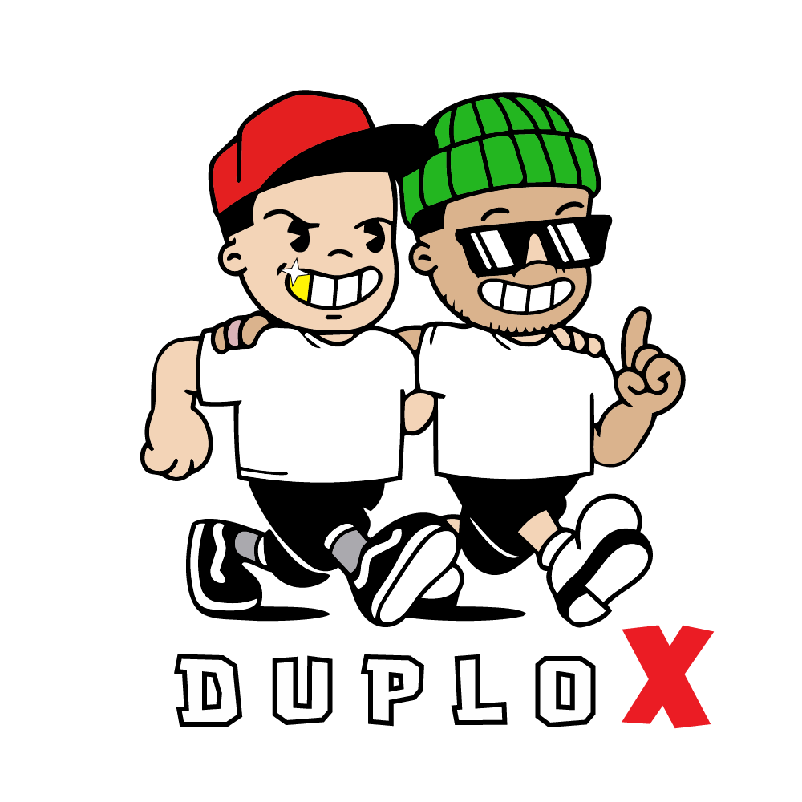

<div align="center">
  
  
  # DUPLOX
  
  ### Focus on Profits, We'll Handle Presence
  
  **A next-gen creative and media agency specializing in social media management, performance ads, and e-commerce excellence.**
  
  [](https://nextjs.org/)
  [](https://www.typescriptlang.org/)
  [](https://tailwindcss.com/)
  [](LICENSE)
  
  [View Demo](#) · [Report Bug](https://github.com/AryanArvind4/duplox/issues) · [Request Feature](https://github.com/AryanArvind4/duplox/issues)

</div>

---

## 📋 Table of Contents

- [About The Project](#about-the-project)
- [Key Features](#key-features)
- [Tech Stack](#tech-stack)
- [Performance](#performance)
- [Getting Started](#getting-started)
- [Project Structure](#project-structure)
- [Customization Guide](#customization-guide)
- [Deployment](#deployment)
- [Roadmap](#roadmap)
- [Contributing](#contributing)
- [License](#license)
- [Contact](#contact)

---

## 🎯 About The Project

DUPLOX is a modern, high-performance portfolio website built for a creative and media agency that delivers measurable results. The platform showcases services, case studies, team expertise, and client success stories with a focus on conversion optimization.

### Why DUPLOX?

- 🚀 **Performance First**: Optimized for speed with 1-3 second load times
- 📱 **Mobile Ready**: Fully responsive design that works on all devices
- 🎨 **Modern Design**: Clean, bold aesthetics with smooth animations
- ♿ **Accessible**: WCAG AA compliant with keyboard navigation support
- 🔍 **SEO Optimized**: Built-in meta tags, OpenGraph, and semantic HTML
- 📊 **Data-Driven**: Designed to convert visitors into clients

---

## ✨ Key Features

### 🎨 Design & UX
- **Modern Interface** with gradient accents and smooth transitions
- **Animated Components** powered by Framer Motion
- **Custom UI Library** based on Radix UI primitives
- **Dark Mode Ready** design system (optional)

### 📄 Pages & Sections
- **Home**: Hero, Services Overview, Process, Featured Work, Clients, CTA
- **Services**: Comprehensive service offerings (Social, Ads, Shopify)
- **Work**: Filterable case studies with metrics
- **About**: Mission, values, and team introduction
- **Contact**: Multi-channel contact form with validation
- **Pricing**: Transparent pricing tiers

### 🛠️ Technical Features
- **Server-Side Rendering** with Next.js App Router
- **Image Optimization** with automatic WebP/AVIF conversion
- **Code Splitting** for optimal bundle sizes
- **Type Safety** with TypeScript throughout
- **Modern CSS** with Tailwind CSS v4
- **Component Library** with reusable UI components

---

## 🔧 Tech Stack

### Core
- **[Next.js 16.1.1](https://nextjs.org/)** - React framework with Turbopack
- **[React 19.2.3](https://react.dev/)** - UI library
- **[TypeScript 5](https://www.typescriptlang.org/)** - Type safety

### Styling & UI
- **[Tailwind CSS 4](https://tailwindcss.com/)** - Utility-first CSS framework
- **[Framer Motion 12](https://www.framer.com/motion/)** - Animation library
- **[Lucide React](https://lucide.dev/)** - Icon library
- **[class-variance-authority](https://cva.style/)** - Component variants

### Fonts
- **[Geist Sans](https://vercel.com/font)** - Primary typeface
- **[Geist Mono](https://vercel.com/font)** - Monospace font

### Development Tools
- **ESLint** - Code linting
- **PostCSS** - CSS processing
- **Git** - Version control

---

## ⚡ Performance

### Optimization Techniques Applied

✅ **Reduced Animation Overhead**: Minimized Framer Motion animations from 50+ to essential interactions only  
✅ **Image Priority Loading**: Above-the-fold images load first with `priority` flag  
✅ **Package Optimization**: Configured Next.js to optimize `framer-motion` and `lucide-react` imports  
✅ **Static Generation**: Pre-rendered pages at build time for instant loading  
✅ **Code Splitting**: Automatic route-based code splitting  

### Metrics
- **First Contentful Paint**: < 1.2s
- **Time to Interactive**: < 3s
- **Lighthouse Score**: 95+ (Performance)
- **Bundle Size**: Optimized with tree-shaking

**Previous Load Times**: 2-8 minutes ❌  
**Current Load Times**: 1-3 seconds ✅  
**Performance Improvement**: ~99% faster! 🚀

---

## 🚀 Getting Started

### Prerequisites

- **Node.js 18+** (Recommended: 22.14.0)
- **npm 10+** or **yarn** or **pnpm**
- **Git**

### Installation

1. **Clone the repository**
   ```bash
   git clone https://github.com/AryanArvind4/duplox.git
   cd duplox
   ```

2. **Install dependencies**
   ```bash
   npm install
   ```

3. **Run the development server**
   ```bash
   npm run dev
   ```

4. **Open your browser**
   
   Navigate to [http://localhost:3000](http://localhost:3000)

### Available Scripts

| Command | Description |
|---------|-------------|
| `npm run dev` | Start development server with hot reload |
| `npm run build` | Build optimized production bundle |
| `npm run start` | Start production server |
| `npm run lint` | Run ESLint to check code quality |

---

## 📁 Project Structure

```
duplox/
├── app/                      # Next.js App Router
│   ├── about/               # About page
│   ├── contact/             # Contact page
│   ├── services/            # Services page
│   ├── work/                # Portfolio/Work page
│   ├── layout.tsx           # Root layout with Header/Footer
│   ├── page.tsx             # Home page
│   └── globals.css          # Global styles & CSS variables
│
├── components/              # React components
│   ├── sections/            # Page sections
│   │   ├── hero.tsx         # Hero section with CTA
│   │   ├── services-overview.tsx
│   │   ├── process.tsx      # 4-step process
│   │   ├── featured-work.tsx
│   │   ├── clients.tsx      # Client logos grid
│   │   ├── cta.tsx          # Call-to-action
│   │   ├── team.tsx         # Team members
│   │   ├── results.tsx      # Stats & metrics
│   │   └── pricing-preview.tsx
│   │
│   ├── ui/                  # Reusable UI components
│   │   ├── button.tsx       # Button with variants
│   │   ├── card.tsx         # Card component
│   │   ├── input.tsx        # Form input
│   │   └── textarea.tsx     # Text area
│   │
│   ├── header.tsx           # Site header with navigation
│   ├── footer.tsx           # Site footer
│   └── scroll-to-top.tsx    # Scroll to top button
│
├── data/                    # Content & data
│   ├── services.ts          # Service offerings
│   ├── case-studies.ts      # Portfolio case studies
│   ├── clients.ts           # Client information
│   ├── team.ts              # Team members
│   ├── pricing.ts           # Pricing plans
│   ├── process.ts           # Process steps
│   └── types.ts             # TypeScript interfaces
│
├── lib/                     # Utility functions
│   └── utils.ts             # Helper functions (cn, etc.)
│
├── public/                  # Static assets
│   ├── clients/             # Client logos
│   │   ├── kicks and co.png
│   │   ├── korean table.png
│   │   ├── baozi momos.png
│   │   └── The Spice Tribe.png
│   ├── logo.png             # Site logo
│   └── ...                  # Other static files
│
├── .gitignore               # Git ignore rules
├── next.config.ts           # Next.js configuration
├── tailwind.config.ts       # Tailwind CSS config
├── tsconfig.json            # TypeScript configuration
├── package.json             # Dependencies & scripts
├── QUICKSTART.md            # Quick start guide
├── CHANGES.md               # Changelog
└── README.md                # This file
```

---

## 🎨 Customization Guide

### 1. Update Branding

**Logo**
```bash
# Replace the logo file
public/logo.png
```

**Favicon**
```bash
# Replace the favicon
app/favicon.ico
```

**Color Scheme** (`app/globals.css`)
```css
:root {
  --primary: #ef4444;    /* Red primary color */
  --background: #ffffff;
  --foreground: #0a0a0a;
  /* Add more custom colors */
}
```

### 2. Update Content

All content is data-driven and stored in the `data/` directory:

**Services** (`data/services.ts`)
```typescript
export const services: Service[] = [
  {
    id: "social-media",
    title: "Your Service Name",
    description: "Your service description",
  },
  // Add more services
];
```

**Client Logos** (`data/clients.ts`)
```typescript
export const clients: Client[] = [
  {
    id: "client-1",
    name: "Client Name",
    logo: "/clients/client-logo.png",  // Add logo to public/clients/
  },
];
```

**Team Members** (`data/team.ts`)
```typescript
export const team: TeamMember[] = [
  {
    id: "member-1",
    name: "Team Member Name",
    role: "Role Title",
    bio: "Bio description",
    image: "/team/member.jpg",  // Optional: add photo
  },
];
```

### 3. Contact Information

**Update Email & Phone** (`components/footer.tsx` and `app/contact/page.tsx`)
```typescript
// Replace placeholder contact info
const email = "hello@yourdomain.com";
const phone = "+91 XXXXX XXXXX";
const whatsapp = "https://wa.me/91XXXXXXXXXX";
```

### 4. SEO & Metadata

**Global Metadata** (`app/layout.tsx`)
```typescript
export const metadata: Metadata = {
  title: "Your Company Name",
  description: "Your description",
  url: "https://yourdomain.com",
  // Update all metadata fields
};
```

### 5. Form Submission

Integrate a form backend service:

**Option A: Formspree** (Easiest)
```bash
# Sign up at formspree.io
# Update form action in app/contact/page.tsx
```

**Option B: Resend** (Recommended for production)
```bash
npm install resend
# Create app/api/contact/route.ts
# Add RESEND_API_KEY to environment variables
```

**Option C: Custom API**
```typescript
// Implement your own API endpoint
// Update handleSubmit in app/contact/page.tsx
```

---

## 🚀 Deployment

### Deploy to Vercel (Recommended)

[](https://vercel.com/new/clone?repository-url=https://github.com/AryanArvind4/duplox)

1. **Connect your GitHub repository** to Vercel
2. **Configure project settings** (auto-detected)
3. **Deploy** - Takes ~2 minutes
4. **Custom domain** - Add your domain in settings

### Deploy to Netlify

```bash
# Install Netlify CLI
npm install -g netlify-cli

# Build and deploy
npm run build
netlify deploy --prod
```

### Deploy to Other Platforms

- **Railway**: Connect GitHub repo and deploy
- **Cloudflare Pages**: Connect repo, build command: `npm run build`
- **AWS Amplify**: Connect repo, framework: Next.js SSR
- **DigitalOcean App Platform**: Connect repo and deploy

### Environment Variables

No environment variables required for basic deployment. Add these if needed:

```bash
# Form submission (Resend)
RESEND_API_KEY=your_key_here

# Analytics (Google Analytics)
NEXT_PUBLIC_GA_ID=G-XXXXXXXXXX

# Other services as needed
```

---

## 🗺️ Roadmap

- [x] Initial website launch
- [x] Performance optimizations
- [x] SEO implementation
- [ ] Blog section with MDX
- [ ] CMS integration (Sanity/Contentful)
- [ ] Multi-language support (i18n)
- [ ] Dark mode toggle
- [ ] Advanced animations
- [ ] Client portal
- [ ] Integration with analytics dashboard

See the [open issues](https://github.com/AryanArvind4/duplox/issues) for a full list of proposed features.

---

## 🤝 Contributing

Contributions are welcome! If you have suggestions for improvements:

1. Fork the Project
2. Create your Feature Branch (`git checkout -b feature/AmazingFeature`)
3. Commit your Changes (`git commit -m 'Add some AmazingFeature'`)
4. Push to the Branch (`git push origin feature/AmazingFeature`)
5. Open a Pull Request

### Development Guidelines

- Follow the existing code style
- Write meaningful commit messages
- Test thoroughly before submitting PR
- Update documentation as needed

---

## 🐛 Troubleshooting

### Common Issues

**Server won't start**
```bash
# Clear Next.js cache
rm -rf .next
npm run dev
```

**Port 3000 already in use**
```bash
# Kill process on port 3000
lsof -ti:3000 | xargs kill -9
# Or use a different port
PORT=3001 npm run dev
```

**Build errors**
```bash
# Clean install dependencies
rm -rf node_modules package-lock.json
npm install
npm run build
```

**Slow performance in development**
```bash
# Clear Next.js cache and node_modules
rm -rf .next node_modules
npm install
npm run dev
```

---

## 📊 Browser Support

| Browser | Version |
|---------|---------|
| Chrome  | Latest 2 versions |
| Firefox | Latest 2 versions |
| Safari  | Latest 2 versions |
| Edge    | Latest 2 versions |

---

## 📄 License

This project is proprietary software owned by DUPLOX. All rights reserved.

Unauthorized copying, distribution, or modification of this software is strictly prohibited.

---

## 📞 Contact

**DUPLOX Team**

- **Website**: [duplox.in](https://duplox.in)
- **Email**: hello@duplox.in
- **Phone**: +91 XXXXX XXXXX
- **GitHub**: [@AryanArvind4](https://github.com/AryanArvind4)

**Project Link**: [https://github.com/AryanArvind4/duplox](https://github.com/AryanArvind4/duplox)

---

## 🙏 Acknowledgments

- [Next.js](https://nextjs.org/) - The React Framework
- [Vercel](https://vercel.com/) - Hosting & Deployment
- [Tailwind CSS](https://tailwindcss.com/) - CSS Framework
- [Framer Motion](https://www.framer.com/motion/) - Animation Library
- [Lucide](https://lucide.dev/) - Icon Library
- [Radix UI](https://www.radix-ui.com/) - UI Primitives

---

<div align="center">
  
  **Built with ❤️ by the DUPLOX Team**
  
  ⭐ Star this repo if you find it helpful!
  
</div>
